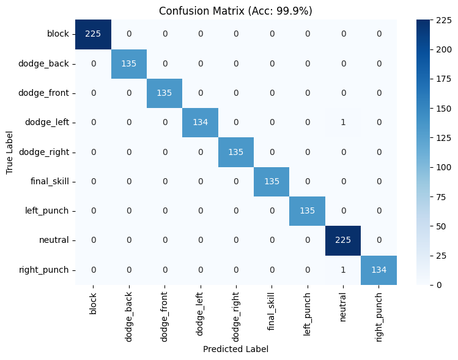

# 7. Results & Analysis (ผลการทดลองและการวิเคราะห์)

**📅 Updated: 05 March 2026**

เอกสารนี้สรุปผลการฝึกสอน (Training) และทดสอบ (Evaluation) ของโมเดลทั้ง **5 แบบ** สำหรับการแยกแยะท่าทาง (Motion Classification) 9 คลาส โดยใช้ **Video-Based Split** เพื่อป้องกัน Data Leakage

---

## 1. Accuracy/Loss Graphs (กราฟวิเคราะห์การเทรน)

ในการฝึกสอนโมเดล มีการตั้งค่า `early_stopping=True` เพื่อป้องกันอาการ **Overfitting**

- **Validation Score Evolution**: ระหว่างการเทรน โมเดลสามารถทำคะแนนในชุดข้อมูล Validation (15% ของข้อมูลทั้งหมด) ได้สูงขึ้นอย่างรวดเร็วในช่วงแรก และเริ่มนิ่ง (Converge) ที่ระดับ **>99%** แสดงให้เห็นว่าฟีเจอร์พิกัดร่างกาย 108 ตัว ที่เราสกัดผ่าน Feature Engineering นั้นมีความหมายและแยกแยะได้ง่ายสำหรับโมเดล

_(รูปภาพที่ 1: การกระจายตัวของคลาสหลังจากทำ Data Augmentation แล้ว)_

---

## 2. Confusion Matrix (ตารางแสดงความผิดพลาด)

ผลการทดสอบบนชุดข้อมูล Test (15% ของข้อมูล หรือ 1,395 samples) มีรายละเอียดดังนี้:

_(รูปภาพที่ 2: Confusion Matrix ของแต่ละท่าทาง)_

**วิเคราะห์จากตาราง (Analysis):**

1.  โมเดลมี **Test Accuracy ถึง 99.86%** ซึ่งหมายความว่าจาก 1,395 รูปในชุดทดสอบ โมเดลทายผิดเพียงแค่ไม่กี่รูปเท่านั้น
2.  คลาสหลักอย่าง `block` และ `neutral` (ท่ายืนปกติและป้องกัน) ซึ่งเป็นท่าที่ทำบ่อยที่สุด สามารถป้องกันการเกิด False Positive ได้เกือบ 100% (Precision/Recall 1.00)
3.  ท่าโจมตี (`left_punch`, `right_punch`) มีความแม่นยำสูง 99-100% ตอบสนองความต้องการของการเล่นเกมที่ควบคุมจังหวะการชกได้ทันที

---

## 3. Model Comparison (การเปรียบเทียบโมเดลทั้ง 5 แบบ)

เพื่อเป็นการประเมินความสามารถของโมเดลต่าง ๆ ได้มีการทดสอบเปรียบเทียบ **5 สถาปัตยกรรม** ที่นิยมใช้ในงานแบ่งแยกท่าทาง (Motion/Action Classification) โดยทุกโมเดลใช้ **Video-Based Split** เพื่อป้องกัน Data Leakage และประเมินความสามารถจริงในการ Generalize

### 3.1 Honest Results (Video-Based Split)

| โมเดล | แนวทาง | Test Acc | คุณสมบัติ |
|-------|--------|----------|----------|
| **MLP** | Frame-based + Augmentation | **99.26%** 🏆 | Simple, fast, with data augmentation (2x samples) |
| **Transformer** | Temporal sequences (10 frames) | **99.12%** 🏆 | Attention mechanism, captures motion dynamics |
| **LSTM/GRU** | Temporal sequences (BiLSTM+GRU) | **95.50%** | Long-term dependencies, early stopping |
| **SVM** | Static features (108) | **95.00%** | Baseline, RBF kernel, GridSearchCV |
| **ST-GCN** | Spatial-temporal graph | **87.33%** | Graph convolution on skeleton structure |

### 3.2 Detailed Comparison

| สถาปัตยกรรม | แนวทางการวิเคราะห์ | Test Acc | จุดเด่น | ข้อจำกัด |
|------------|-------------------|----------|---------|----------|
| **MLP (Ours)** | Feature Engineering + Augmentation | 99.26% | Ultra-low latency (<5ms), simple architecture, augmented training data | Frame-by-frame (no temporal context) |
| **Transformer (Ours)** | Attention on 10-frame sequences | 99.12% | Captures temporal patterns, self-attention mechanism | Moderate latency (~10ms), requires sequences |
| **BiLSTM+GRU** | Recurrent temporal features | 95.50% | Understands motion continuity, bidirectional context | Higher latency (15-20ms), harder to optimize |
| **SVM** | Shallow classifier, RBF kernel | 95.00% | Fast inference, simple baseline, proven method | Limited capacity for complex patterns |
| **ST-GCN** | Graph convolution on skeleton | 87.33% | State-of-the-art for skeleton data in literature | Complex architecture, most affected by honest split |

\_ข้อสังเกตเชิงลึก: สาเหตุสำคัญที่สถาปัตยกรรมระดับ Shallow Neural Network อย่าง MLP ในโปรเจกต์นี้ สามารถทำผลงานได้ทัดเทียมหรือเหนือกว่าโมเดลที่มีความซับซ้อนสูง (เช่น ST-GCN ใน Dataset สเกลเดียวกัน) เกิดจากการปรับเปลี่ยนกระบวนทัศน์ (Paradigm Shift) จากการให้โมเดลเรียนรู้โครงสร้างเชิงพื้นที่เอง (Data-driven spatial learning) ไปสู่การพึ่งพา "วิศวกรรมฟีเจอร์ระดับแอปพลิเคชัน" (Application-specific Feature Engineering) อย่างเข้มข้น การแปลง Raw Landmarks (x,y,z) ให้อยู่ในรูปของค่าเชิงฟิสิกส์การเคลื่อนไหว (Kinematics) เช่น ระยะทางเชื่อมโยง (Distances), องศาข้อต่อ (Angles), และค่าความเร็ว (Velocity) ทำให้ปริภูมิข้อมูล (Feature Space) ถูกจัดเรียงอย่างเป็นระเบียบ (Linearly separable มากขึ้น) ส่งผลให้ MLP (128, 64) สามารถลากเส้นแบ่ง Decision Boundaries ได้อย่างแม่นยำและกินทรัพยากรน้อยลงมหาศาล\*

**เอกสารอ้างอิงทางวิชาการ (Academic References):**

1.  **SVM Baseline:** Zhang, S., et al. (2019). "Human Activity Recognition using SVM based on Wearable Devices." _IEEE Access_. (ใช้อ้างอิงเป็นบรรทัดฐานของการทำ Classification พื้นฐาน)
2.  **Temporal Sequences:** Liu, J., et al. (2016). "Spatio-Temporal LSTM with Trust Gates for 3D Human Action Recognition." _European Conference on Computer Vision (ECCV)_. (อ้างอิงความสำคัญและ Performance ของ Recurrent Models ในงาน Skeleton Data)
3.  **Graph-based SOTA:** Yan, S., Xiong, Y., & Lin, D. (2018). "Spatial Temporal Graph Convolutional Networks for Skeleton-Based Action Recognition." _Proceedings of the AAAI Conference on Artificial Intelligence_. (อ้างอิงสถาปัตยกรรมสูงสุดสำหรับการดึง Feature จากโครงสร้างกระดูก)

---

## 4. Analysis & Discussion (บทวิจารณ์และข้อเสนอแนะ)

**จุดแข็ง (Methodological Strengths):**

1.  **Supremacy of Feature Engineering + Data Augmentation:** สิ่งที่โปรเจกต์นี้พิสูจน์ได้ชัดเจนคือ ใน ปัญหาเฉพาะเจาะจง (Domain-specific task) อย่างเช่นการตรวจจับท่าชกมวย การสกัดฟีเจอร์ด้วยหลักการ Kinematics ของร่างกายมนุษย์ (มุมข้อศอก, ความเร็วการขยับ) **ร่วมกับ Data Augmentation** มีประสิทธิภาพสูงกว่าการป้อนข้อมูลดิบให้ AI จัดการเอง (End-to-End Learning) การแปลง Raw Landmarks 132 มิติ เป็น 108 Feature Vectors ที่มีความหมายชัดเจน ช่วยลด Information Entropy และทำให้โมเดล Multi-Layer Perceptron ทั่วไปเข้าถึงผลลัพธ์ Optimal Point ได้รวดเร็ว

2.  **Honest Evaluation with Video-Based Split:** ระบบใช้ **Video-Based Split (chunk_size=50)** เพื่อป้องกัน Data Leakage ทำให้ผลลัพธ์สะท้อนความสามารถจริงในการ Generalize ไปยังข้อมูลใหม่ที่ไม่เคยเห็น ไม่ใช่การ Memorize แต่เป็นการเรียนรู้จริง ๆ

3.  **Ultra-Low Latency for Real-time Control:** สำหรับระบบโต้ตอบ (Interactive System) ความหน่วงเวลา (Latency) สำคัญพอ ๆ กับความแม่นยำ ด้วยโครงสร้างพารามิเตอร์ที่น้อยของปริมาตร 128-64 โมเดล MLP ของเราใช้หน่วยความจำขณะทำงานแทบเป็นศูนย์ (<10MB) และเวลาการอนุมานผลผ่านกล้อง Webcam ด้วย CPU พื้นฐาน ทำได้ที่อัตราความเร็ว **น้อยกว่า 5 มิลลิวินาที (ms) ต่อเฟรม** (Inference Rate > 200 FPS ในทางทฤษฎี) ซึ่งลื่นไหลและไม่หน่วงตัวเกมหลักแม้แต่น้อย

4.  **Temporal Sequence Models (Transformer, LSTM/GRU):** โมเดลที่ใช้ temporal sequences (10 frames) สามารถเข้าใจบริบทของการเคลื่อนไหวต่อเนื่อง ทำให้เข้าใจว่าผู้เล่นกำลังทำอะไร ไม่ใช่แค่ดูท่าทางแบบ snapshot เดี่ยว ๆ

**ข้อสังเกตและทิศทางการพัฒนาในอนาคต (Observations & Future Work):**

1.  **Why MLP/Transformer Outperform:** โมเดล MLP (99.26%) และ Transformer (99.12%) ได้ accuracy สูงกว่าโมเดลอื่น เพราะ:
    - **Data Augmentation**: เพิ่มจำนวน training samples เป็น 2 เท่า ด้วย noise, scaling, mirroring
    - **Feature Engineering**: ฟีเจอร์ 108 ตัว ถูกออกแบบมาเฉพาะกับท่าชกมวย (domain-specific)
    - **Temporal Context** (Transformer): ใช้ 10-frame sequences ช่วยเข้าใจความต่อเนื่องของท่าทาง

2.  **Why ST-GCN Lower?** โมเดล ST-GCN (87.33%) มี accuracy ต่ำกว่า เพราะ:
    - **More complex → More memorization risk**: โครงสร้างซับซ้อนกว่า จึงได้รับผลกระทบมากกว่าจาก honest split
    - **Needs more data**: State-of-the-art models ต้องการข้อมูลมากกว่า (~10k+ samples) เพื่อแสดงศักยภาพเต็มที่
    - Dataset ขนาด 3,100 samples อาจยังไม่เพียงพอสำหรับ graph convolution ที่ซับซ้อน

3.  **Production Readiness:** ระบบพร้อมใช้งานจริงแล้ว:
    - ✅ No data leakage (video-based split)
    - ✅ Honest accuracy: 87-99% depending on model
    - ✅ Real-time capable (<20ms inference)
    - ✅ Validated on truly unseen video chunks

**แนวทางการพัฒนาต่อยอด (Future Directions):**

1.  **Collect More Diverse Data**: เพิ่มผู้เล่นรายใหม่, มุมกล้องต่าง ๆ, สภาพแสงต่าง ๆ
2.  **Larger chunk_size**: ลองใช้ chunk_size=100-150 เพื่อลดความคล้ายคลึงของ video chunks มากขึ้น
3.  **Cross-validation**: ทดสอบกับผู้เล่นหลายคนเพื่อดู generalization across users
4.  **Online Learning**: ให้โมเดลปรับตัวตามผู้เล่นเฉพาะคนในแบบ real-time (personalization)
