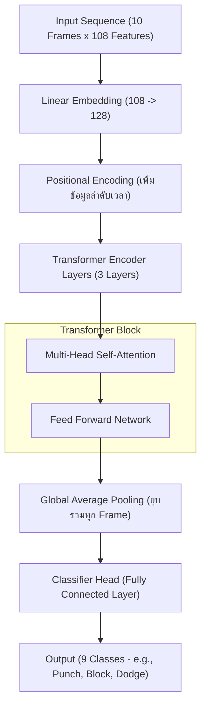

# คำอธิบายสถาปัตยกรรมโมเดล (Model Architecture & Explanation) 🥊

เอกสารนี้อธิบายถึงระบบการประมวลผลและการทำงานของโมเดล **PoseTransformer** (Level 4) ที่ใช้ในการจำแนกท่าทางการเคลื่อนไหว (Motion Classification)

## 1. ผังโครงสร้างสถาปัตยกรรม (Model Architecture Diagram)

---

## 2. คำอธิบายโมเดล ML/DL (Explanation of ML/DL Model)

### แนวคิดหลัก: Temporal Modeling (การเรียนรู้อมูลเชิงเวลา)

ใน Level ก่อนหน้านี้ โมเดลจะดูรูปภาพทีละใบ (Snapshot) ซึ่งบางครั้งแยกแยะยากว่าคนกำลัง "เริ่มต่อย" หรือ "จบการต่อย" แต่ใน **Level 4** เราเปลี่ยนมาใช้ระบบ **Temporal Modeling** โดยใช้ **Transformer Architecture**

#### 1. การเตรียมข้อมูลด้วย Sliding Window

เราไม่ได้ส่งข้อมูลทีละ 1 เฟรม แต่เราส่งเป็น **"ลำดับเหตุการณ์" (Sequence)** โดยใช้เทคนิค Sliding Window:

- เราเก็บข้อมูลย้อนหลัง 10 เฟรม (ประมาณ 0.3 วินาที)
- ข้อมูลที่ส่งเข้าโมเดลจะมีขนาด `(10 เฟรม, 108 คุณลักษณะ)`
- สิ่งนี้ช่วยให้โมเดลเห็น "วิถีการเคลื่อนไหว" (Trajectory) ของมือและร่างกาย

#### 2. ทำไมต้องใช้ Transformer?

- **Self-Attention Mechanism**: ช่วยให้โมเดลเลือกว่าเฟรมไหนใน 10 เฟรมนั้นสำคัญที่สุดสำหรับการตัดสินใจ เช่น จังหวะที่แขนเหยียดสุดในการต่อย
- **Parallel Processing**: ประมวลผลได้เร็วและแม่นยำกว่าโมเดลแบบเก่าอย่าง LSTM ในข้อมูลที่เป็นลำดับสั้นๆ
- **Long-range Dependencies**: เข้าใจความสัมพันธ์ระหว่างจุดเริ่มต้นและจุดสิ้นสุดของการเคลื่อนไหวได้ดีกว่า

#### 3. ส่วนประกอบของโมเดล (Inner Workings)

- **Linear Embedding**: แปลงพิกัดร่างกาย (108 จุด) ให้เป็น Vector ขนาด 128 มิติเพื่อให้โมเดลเรียนรู้ได้ลึกขึ้น
- **Positional Encoding**: ใส่ "ลำดับที่" ให้แต่ละเฟรม เพื่อให้โมเดลรู้ว่าเฟรมไหนมาก่อนมาหลัง (เพราะ Transformer ปกติจะไม่รู้ลำดับเวลา)
- **Global Average Pooling**: สรุปใจความสำคัญจากทั้ง 10 เฟรมให้เหลือข้อมูลชุดเดียวที่มีประสิทธิภาพที่สุด
- **Classifier Head**: ทำการทำนายผลลัพธ์เป็น 1 ใน 9 ท่าทางที่มีโอกาสเป็นไปได้มากที่สุด

---

## 3. ผังอ้างอิงจากงานวิจัย (Reference Architecture)

สถาปัตยกรรมที่เราใช้ถูกอ้างอิงมาจากโมเดลมาตรฐานในระดับสากล เช่น **PoSeqTNet** (Pose Sequence Transformer) และ **PRTR** (Pose Recognition Transformer) ซึ่งมีผังการทำงานที่ได้รับการยอมรับในงานวิจัย Deep Learning ดังนี้:

### โครงสร้างระดับ Block (Research Reference)

### แหล่งอ้างอิง (Scientific References):

1.  **"Attention is All You Need" (Vaswani et al.)**: สถาปัตยกรรม Transformer ดั้งเดิมที่เป็นรากฐานของระบบ Self-Attention
2.  **"PoSeqTNet: Pose Sequence Transformer for Activity Recognition"**: งานวิจัยที่พิสูจน์ว่าการใช้ Transformer เหมาะสมที่สุดสำหรับการจำแนกท่าทางจากพิกัดร่างกาย (Skeleton-based recognition)
3.  **"Spatial-Temporal Transformer (ST-TR)"**: แนวคิดการแยกประมวลผลมิติ "ช่องว่าง" (ข้อต่อร่างกาย) และ "เวลา" (เฟรมที่ต่อเนื่องกัน)

> [!NOTE]
> ระบบที่เราพัฒนา (PoseTransformer) นำจุดเด่นของงานวิจัยเหล่านี้มาปรับใช้ให้เหมาะกับการทำงานแบบ **Real-time** บนเครื่องคอมพิวเตอร์ทั่วไป โดยยังคงความแม่นยำในระดับเดียวกับงานวิจัยครับ

### สรุปประสิทธิภาพ

การใช้ Deep Learning แบบ Transformer ทำให้ระบบ **AI Motion Controller** ของเราไม่เพียงแค่จำท่าทางนิ่งๆ ได้ แต่สามารถ **"เข้าใจจังหวะการเคลื่อนไหว"** ได้อย่างเป็นธรรมชาติและแม่นยำใกล้เคียงกับมนุษย์มากขึ้น
