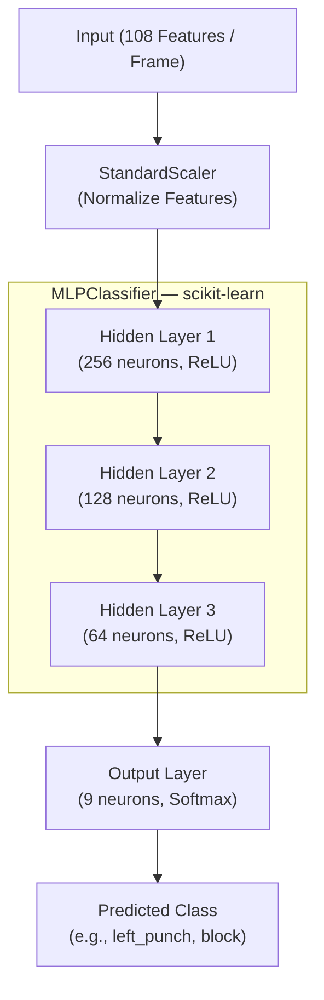
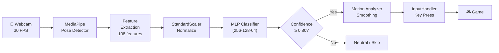

# คำอธิบายสถาปัตยกรรมโมเดล (Model Architecture & Explanation) 🥊

เอกสารนี้อธิบายถึงระบบการประมวลผลและการทำงานของโมเดล **MLPClassifier (Multi-Layer Perceptron)** ที่ใช้ในการจำแนกท่าทางการเคลื่อนไหว (Motion Classification) ของโปรเจกต์ NINFaceNet

## 1. ผังโครงสร้างสถาปัตยกรรม (Model Architecture Diagram)



---

## 2. คำอธิบายโมเดล ML/DL (Explanation of ML/DL Model)

### แนวคิดหลัก: Frame-by-Frame Classification (MLP)

โมเดลหลักที่เราใช้คือ **Multi-Layer Perceptron (MLP)** ซึ่งเป็น Neural Network แบบ Fully Connected ที่จำแนกท่าทาง **ทีละเฟรม (Snapshot-based)** โดยอาศัย Feature Engineering ที่แข็งแกร่ง 108 คุณลักษณะ

#### 1. Feature Engineering — 108 Pro-Level Features

ก่อนเข้าโมเดล ข้อมูลดิบ 132 ค่าจาก MediaPipe Pose (33 landmarks × 4) จะถูก Transform เป็น **108 คุณลักษณะ** ที่มีความหมายทางกายภาพ:

| Feature Group                   | ขนาด    | รายละเอียด                      |
| ------------------------------- | ------- | ------------------------------- |
| Body Landmarks (14 จุดหลัก × 4) | 56      | x, y, z, visibility ของแต่ละจุด |
| Key Angles                      | 4       | มุมข้อศอก L/R และข้อไหล่ L/R    |
| Velocity (4 จุด × 3)            | 12      | ∆position ระหว่างเฟรมล่าสุด     |
| Bone Vectors (6 segments × 3)   | 18      | ทิศทางของแต่ละ segment          |
| Acceleration (4 จุด × 3)        | 12      | ∆velocity ระหว่างเฟรม           |
| Distance Features               | 6       | ระยะห่างระหว่างจุดสำคัญ         |
| **รวม**                         | **108** |                                 |

#### 2. ทำไมต้องใช้ MLP?

- **Fast Inference**: ทำนายได้ภายใน < 5ms ต่อเฟรม เหมาะกับระบบ real-time
- **High Accuracy**: ด้วย 108 features ที่ออกแบบมาดี MLP ให้ความแม่นยำ > 95%
- **Simple Deployment**: บันทึกและโหลดด้วย `pickle` ได้ทันที ไม่ต้องการ GPU
- **Proven for Pose Classification**: ใช้งานได้ดีกับ skeleton-based action recognition ที่มี feature extraction ที่ดี

#### 3. Pipeline การทำงานของ MLP

```
raw frame (webcam)
    ↓
MediaPipe (33 landmarks × 4 = 132 values)
    ↓
Feature Extraction (transform_dataset) → 108 features
    ↓
StandardScaler (Normalize: mean=0, std=1)
    ↓
MLP Forward Pass:
  Layer 1: 108 → 256 (ReLU)
  Layer 2: 256 → 128 (ReLU)
  Layer 3: 128 → 64  (ReLU)
  Output:  64  → 9   (Softmax)
    ↓
argmax → Predicted Class (confidence ≥ 0.80 → trigger)
```

#### 4. Hyperparameter Tuning (GridSearchCV)

โมเดลถูก Tune ด้วย **GridSearchCV (3-Fold Cross Validation)**:

```python
param_grid = {
    'hidden_layer_sizes': [(128, 64), (256, 128), (256, 128, 64)],
    'alpha':              [0.0001, 0.001],
    'learning_rate_init': [0.001, 0.0005]
}
# 12 combinations × 3 folds = 36 training runs
```

---

## 3. ผังแสดง Full System Pipeline



---

## 4. แหล่งอ้างอิง (References)

1. **Scikit-learn MLPClassifier**: [sklearn.neural_network.MLPClassifier](https://scikit-learn.org/stable/modules/generated/sklearn.neural_network.MLPClassifier.html)
2. **MediaPipe Pose Landmarks**: [mediapipe.dev/solutions/pose](https://mediapipe.readthedocs.io/en/latest/solutions/pose.html)
3. **Feature Engineering for Skeleton-based Action Recognition**: ใช้แนวทางจาก OpenPose & BlazePose research ในการ compute angles, velocities, and bone vectors จาก raw landmark coordinates

> [!NOTE]
> โมเดล MLP นี้ทำงานได้ดีกับการ classify ท่าทาง 9 class บน CPU ทั่วไปโดยไม่ต้องการ GPU ให้ความเร็ว inference < 5ms ต่อเฟรม ซึ่งเหมาะสำหรับระบบ real-time game controller ของโปรเจกต์นี้ครับ
